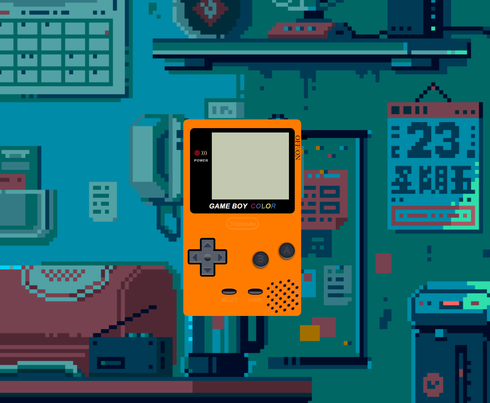
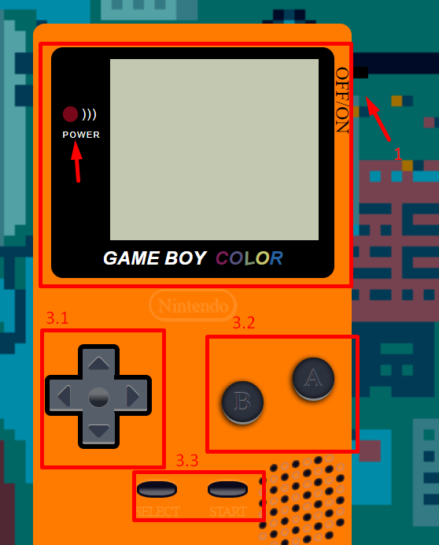

# Gameboy color

En este repositorio encontraras mi versión de una gameboy color, con funcionalidad en algunos botones.

## Construido con 🛠️

* [HTML]
* [CSS]
* [JAVASCRIP]

## Deploy 🚀

* Url de [producción](jorgelozadev.github.io/gameboy/) 

## Wiki 📖

Ahora te explicaremos como funciona mi gameboy color.

Home

En esta pantalla nos encontraremos, un gif de fondo y veremos la Gameboy apagada en el centro de la pantalla.

En esta imagen vemos diferentes apartados.
1-On/Off: Es un botón que esta situado en la parte superior izquierda de la consola y como su nombre indica sirve para encender y apagar la consola.

2-Pantalla: En la parte izquierda veremos una luz, la cual nos indicara si la consola esta encendida o apagado, dependiendo del color. En la parte derecha tenemos la pantalla, en ella visualizaremos todo el contenido de la Gameboy.

3-Botones: Estan divididos en 3 partes.
 1- La cruzeta: Nos servira para movernos por el menú, actualmente solo tiene funcionalidad los botones de arriba y abajo.
 2- Botones "A - B": Son botones de "acción" de la Gameboy, actualmente solo tiene funcionalidad el botón "A", sirve para seleccionar elementos del menú
 3 - Botones "SELECT - START": Son botones de "acción" de la Gameboy, actualmente solo tiene funcionalidad el botón "SELECT", sirve para volver al menú principal.

Cuando encedamos la consola con el botón correspondiente, veremos el logo de carga de la Gameboy y despues en la pantalla veremos 3 opciones, "Trailer","Canción" y "Sorpresa", simplemente tenemos que seleccionar una opción y disfrutar. (Se recomienda subir el volumen para disfrutar mucho mejore de la experiencia)

## Autores ✒️

* **Jorge Loza Guzmán** - *Trabajo Inicial* -  *Documentación* - [JorgeLozaDev](https://github.com/JorgeLozaDev)

---
⌨️ por [JorgeLozaDev](https://github.com/JorgeLozaDev) 